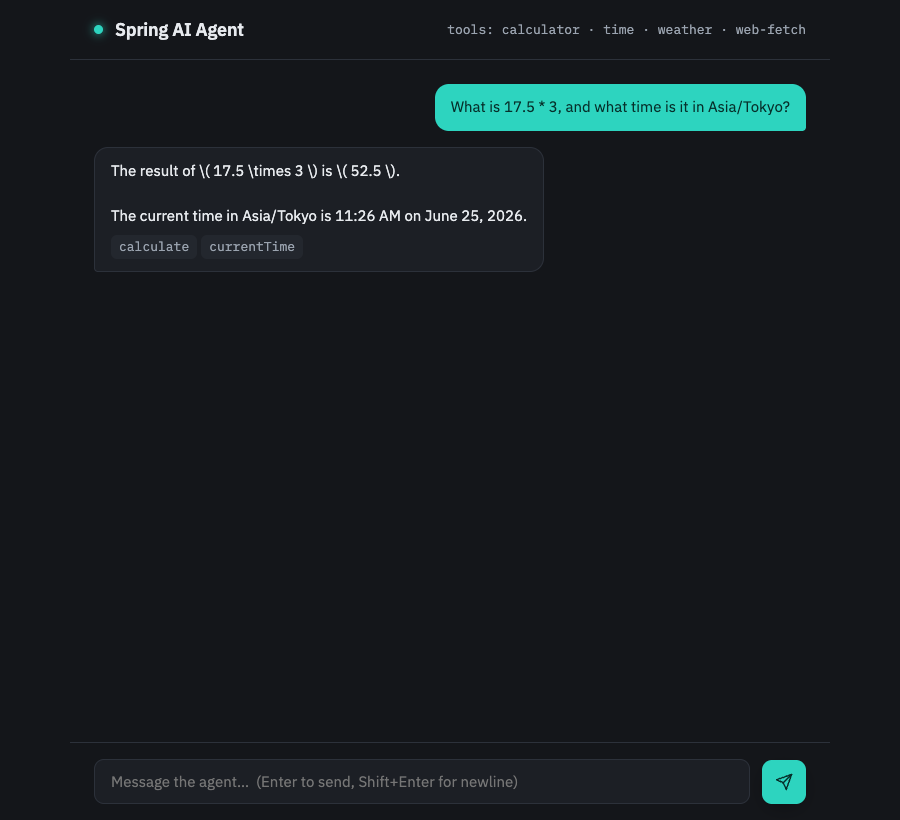
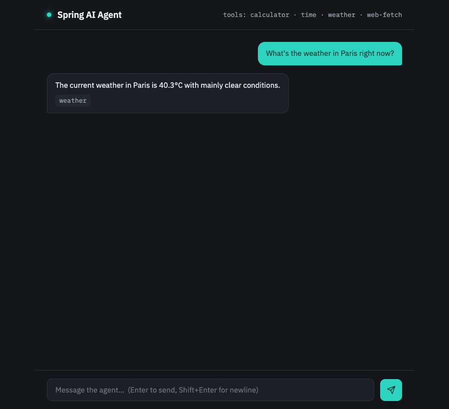

# spring-ai-agent

[](https://github.com/ZeekrBaha/spring-ai-agent/actions/workflows/ci.yml)

A small Java AI agent: an LLM that calls **Spring beans as tools** in a loop until it can answer. Spring Boot 3.5 + Spring AI 1.1, fronted by a REST endpoint and a vanilla chat UI.

## Screenshots
A single turn routing to two tools — the reply shows which tools fired (`calculate`, `currentTime`):



The reply streams in token-by-token over SSE (weather query → `weather` tool):



## What it does
Ask in natural language; the agent routes to the right tool(s) and composes one answer:
- **calculator** — arithmetic
- **time** — current time in an IANA timezone
- **weather** — current conditions for a city (Open-Meteo, no API key)
- **web-fetch** — readable text from a public page (SSRF-guarded)

Each tool is a `@Component` with a `@Tool`-annotated method. Adding a tool = one annotated method; `ChatClient` + `ToolCallingAdvisor` run the loop. Each response reports which tools fired (`toolsUsed`).

## Stack
Java 21 · Spring Boot 3.5.5 · Spring AI 1.1.2 · Maven · REST + static chat UI.

> Note: Spring AI 1.1 is GA against Spring Boot 3.4/3.5 — **not** Boot 4 (which needs Spring AI 2.0). This project pins the stable 3.5 line deliberately.

## Run
```bash
# Option A — env var
export OPENAI_API_KEY=sk-...
mvn spring-boot:run            # open http://localhost:8080

# Option B — local file (gitignored, never packaged)
cp config/application.properties.example config/application.properties
# paste your key into config/application.properties, then:
mvn spring-boot:run
```
The app boots and serves the UI even without a key; chat calls then return a friendly `502`.

**Persistent memory (optional):** conversations survive restarts when run against Postgres.
```bash
docker compose up -d          # postgres:16
mvn spring-boot:run -Dspring-boot.run.profiles=postgres
```

## API
`POST /api/chat`
```json
{ "message": "weather in Paris and what's 12*9?", "conversationId": "optional" }
→ { "reply": "...", "toolsUsed": ["weather","calculator"], "conversationId": "..." }
```
Status codes: `200` ok · `400` blank/too-long message · `429` rate-limited (`Retry-After`) · `502` upstream model failure · `500` internal bug (distinct, not masked).

Streaming: `POST /api/chat/stream` (`text/event-stream`) emits `token` events then a terminal `done` (or `error`) event.

## MCP server
The four tools are also exposed over the **Model Context Protocol**, so MCP clients (Claude Desktop, Cursor, …) can call them.

- **HTTP/SSE** (runs with the web app): SSE endpoint at `/sse`, messages at `/mcp/messages`.
- **stdio** (separate process, clean stdout):
  ```bash
  java -Dspring.profiles.active=mcp-stdio -jar target/agent-0.1.0.jar
  ```
  The `mcp-stdio` profile turns off the web server and the banner and routes all logging to **stderr**, so stdout carries only the MCP JSON-RPC stream.

Claude Desktop config (`claude_desktop_config.json`):
```json
{
  "mcpServers": {
    "spring-ai-agent": {
      "command": "java",
      "args": ["-Dspring.profiles.active=mcp-stdio", "-jar",
               "/absolute/path/to/agent-0.1.0.jar"],
      "env": { "OPENAI_API_KEY": "sk-..." }
    }
  }
}
```
Verified over stdio: `tools/list` returns `calculate`, `currentTime`, `weather`, `fetchUrl`.

## Architecture
Fixed dependency direction (lower never depends on higher):
```
Config (app.yml, ChatClientConfig) → Tools (@Tool beans) → AgentService (ChatClient) → Controller (REST) → UI (static)
```
- **Tool loop** is owned by Spring AI's `ToolCallingAdvisor` — we don't hand-roll it.
- **`toolsUsed`** is captured by wrapping each `ToolCallback` in a `RecordingToolCallback` bound to a per-call `ToolCallSink` — call-scoped and thread-safe, so it stays correct under streaming (reactor threads), unlike a `ThreadLocal`.
- **Tools are sinks**: calculator/time are pure; weather/web-fetch each have one declared outbound-HTTP boundary, visible in the return value.
- **Memory** is a seam (`ChatMemoryStore` interface): `InMemoryChatMemoryStore` (default, bounded per-conversation + LRU) or `JdbcChatMemoryStore` (Postgres, `postgres` profile). Both keep the same bounded contract.
- **Streaming**: `AgentService.chatStream` returns a `Flux<ChatStreamEvent>` (token → done/error); the SSE controller maps events to `text/event-stream`.
- **Provider seam**: swapping OpenAI→Ollama/Claude is a starter dependency + property change; `AgentService` depends only on `ChatClient`.

## Repo map
```
src/main/java/com/baha/agent/
├─ Application.java
├─ config/      ChatClientConfig, AgentTools, McpConfig (MCP tool provider)
├─ tools/       CalculatorTool, TimeTool, WeatherTool, WebFetchTool   (@Tool beans)
├─ agent/       AgentService (chat + chatStream), ChatMemoryStore (interface),
│               InMemoryChatMemoryStore, JdbcChatMemoryStore, ToolCallSink,
│               RecordingToolCallback, ChatResult, ChatStreamEvent, AgentUpstreamException
└─ web/         ChatController, ChatStreamController (SSE), GlobalExceptionHandler,
                filter/RateLimitFilter, dto/{ChatRequest,ChatResponse}
src/main/resources/
├─ application.yml            # + postgres profile, actuator, MCP server
├─ application-mcp-stdio.yml  # stdio MCP profile (clean stdout)
├─ db/migration/V1__chat_message.sql   # Flyway
└─ static/      index.html, app.js, styles.css   (vanilla chat UI)
docker-compose.yml            # postgres:16
docs/
├─ implementation/   v1 spec + v2/ (extensions spec → plan → validation-report)
├─ reviews/          repo engineering review
└─ screenshots/      chat.png, streaming.png
.github/workflows/ci.yml
```

## Test & quality
```bash
mvn verify          # 57 unit + 8 integration (Testcontainers) tests, build, package
mvn spotbugs:check  # static analysis (gating)
```
- **TDD throughout** — RED→GREEN per task; see commit history (`T0`→`T9`, then `B-T*`/`A-T*`/`C-T*`/`D-T*`).
- **CI** (`.github/workflows/ci.yml`): `mvn -B verify` + SpotBugs + GitHub dependency-review, all gating on push/PR.
- Integration tests run real Postgres via **Testcontainers** (Docker required for `mvn verify`).
- Adversarial **refutation passes** + a **live LLM tool-routing eval** recorded in `docs/implementation/validation-report.md` and `docs/implementation/v2/validation-report.md`.

## Security notes
- API key via env var or gitignored `config/` file only; never in source, never in the jar, never sent to the browser.
- web-fetch blocks loopback / private / link-local / IPv6-ULA (`fc00::/7`) / multicast targets and disables redirects.
- Request bodies validated (`@NotBlank`, `@Size(4000)`); tool calls log **name only** (no sensitive args).

## Limitations / next steps
- **Rate limit is single-node + in-memory.** Keyed on remote IP; honors `X-Forwarded-For` only when `agent.ratelimit.trust-forwarded-for=true` (set this only behind a trusted proxy). Distributed (Redis) limiting is a non-goal.
- **No auth** on `/api/chat`, `/api/chat/stream`, or the MCP endpoint — local use; add auth before public exposure.
- **Postgres memory `seq` is instance-scoped** — concurrent appends are safe on one node, but multi-node writers could collide on `(conversation_id, seq)` (horizontal scaling is a non-goal).
- **DNS-rebinding TOCTOU** residual in web-fetch (validate-then-connect re-resolves) — needs socket-level IP pinning.
- Model replies may contain LaTeX (`\( … \)`) rendered as plain text in the minimal UI.
- No per-tool timeouts or distributed tracing yet.

## Configuration
| Property | Default | Meaning |
|----------|---------|---------|
| `OPENAI_API_KEY` | `not-set` | OpenAI key (env var; overridden by `config/application.properties`) |
| `spring.ai.openai.chat.options.model` | `gpt-4o-mini` | model |
| `spring.ai.openai.chat.options.max-tokens` | `800` | output cap |
